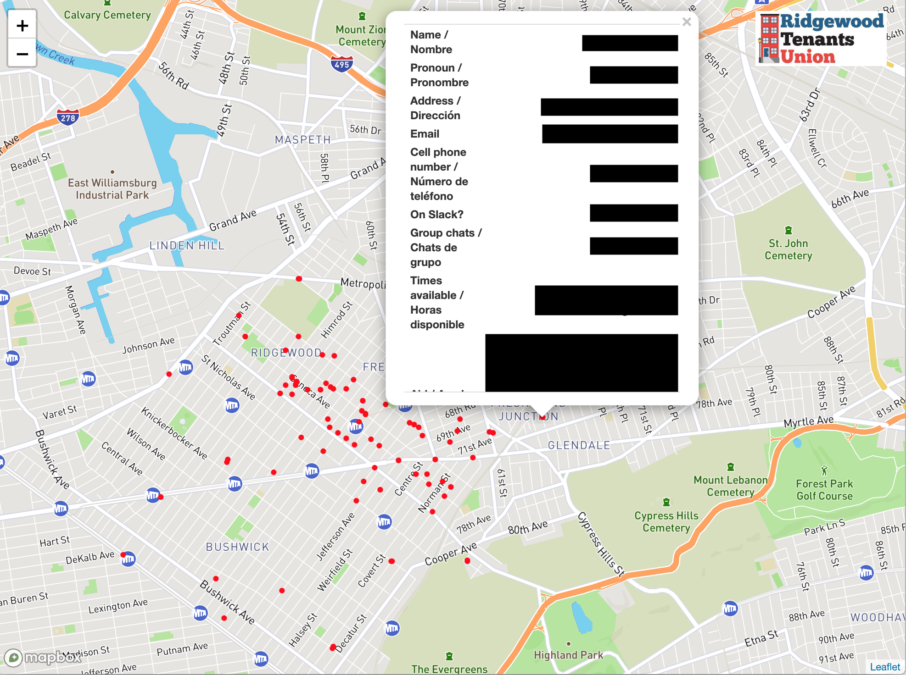

# Unión de Inquilinos de Ridgewood

## Mutual Aid Network Map

This is a quick effort to create a map of volunteers in the [Ridgewood Mutual Aid Network](https://www.ridgewoodtenantsunion.org/resources-recursos/) organized by the [Ridgewood Tenants Union](https://www.ridgewoodtenantsunion.org/). This map helps visualize the distribution of volunteers thorough the neighborhood to identify areas for additional outreach, and can also facilitate matching of requests for support to nearby volunteers who can help. 

Ridgewood Tenants Union has collected information about volunteers through this [Google Form](https://forms.gle/UTfh73Kvbg21thCR7), and the results are saved to a Google Sheet. This R script reads in that data and uses NYC's Geoclient API to help geocode the addresses and Leaflet to create a simple interactive map of the volunteers in the network along with their details provided in the form. For now there is a need for manual geocoding of some locations so the process needs to be run interactively and the map HTML file is uploaded to Google Drive for distribution to users.

### Setup

To recreate this map yourself, you'll first need to install [R](https://cloud.r-project.org/) and [RStudio](https://rstudio.com/products/rstudio/download/#download). 

Edit the file `.env_sample` to fill in the API keys and other information and save it as `.env`. Then open the `rtumap.Rproj` file with RStudio, and open the `make-map.R` file in RStudio. Temporarily uncomment and run the code at the top to install the necessary packages. Then run the full script and you'll be prompted to authorize the connection to your Google account to read/write files from Google Sheets and Google Drive. Then you'll also be prompted to manually geocode the addresses that cannot be located by Geoclient. Finally you can re-run the script to incorporate the manual geocoding results and create the final map and add it to your Google Drive.
